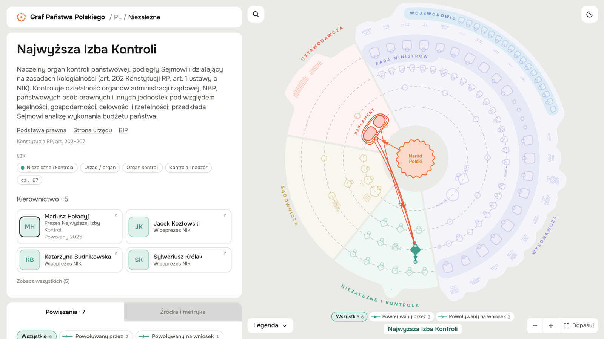

# Graf Państwa Polskiego

Interaktywna mapa organów państwa: kto kogo powołuje, zatwierdza, wybiera, nadzoruje i kontroluje. Od Narodu jako suwerena, przez Sejm, Senat, Prezydenta, Radę Ministrów i sądy, po urzędy centralne i ich jednostki. Każdy węzeł ma podstawę prawną, a każda relacja cytat przepisu z linkiem do aktu.

**Strona:** https://grafpanstwa.pl



Projekt jest obywatelski i nie jest nastawiony na zysk. Dane i kod są otwarte.

> **In English.** An open, interactive graph of the Polish state: bodies, offices, positions and the people who hold them, connected by typed legal relations (appoints, confirms, elects, nominates, oversees). Every node carries its legal basis and every edge cites the statute. Built only from official sources. The visual language is modelled on CivLab's [US Gov Graph](https://graph.civlab.org/us); this project is independent and not affiliated with CivLab.

## Spis treści
1. [Co jest w grafie](#co-jest-w-grafie)
2. [Skąd są dane](#skąd-są-dane)
3. [Jak dane powstały i jak były sprawdzane](#jak-dane-powstały-i-jak-były-sprawdzane)
4. [Struktura danych](#struktura-danych)
5. [Budżet państwa](#budżet-państwa)
6. [Mapa władzy formalnej](#mapa-władzy-formalnej)
7. [Samorząd: województwa, powiaty i gminy](#samorząd-województwa-powiaty-i-gminy)
8. [Jak dane są aktualizowane](#jak-dane-są-aktualizowane)
9. [Jak użyć danych](#jak-użyć-danych)
10. [Uruchomienie i testy](#uruchomienie-i-testy)
11. [Struktura repozytorium](#struktura-repozytorium)
12. [Ograniczenia i znane braki](#ograniczenia-i-znane-braki)
13. [Zgłaszanie błędów](#zgłaszanie-błędów)
14. [Licencje](#licencje)
15. [Inspiracja](#inspiracja)

## Co jest w grafie

Stan danych: **17 września 2026**, wersja 0.1. Zakres to szczebel centralny państwa. Samorządu terytorialnego nie ma i na razie nie będzie.

| Co | Liczba |
|---|---|
| Węzły | 570 |
| Relacje | 1111 |
| Osoby na stanowiskach | 889 |
| Węzły z podstawą prawną i linkiem do aktu | 570 z 570 |
| Relacje z cytatem przepisu i linkiem | 1077 z 1111 (pozostałe to relacje strukturalne „stanowisko szefa”) |
| Osoby ze wskazanym źródłem | 889 z 889 |

Graf pokazuje trzy rzeczy naraz i celowo ich nie miesza:

- **Organ albo urząd**: Sejm, Rada Ministrów, Ministerstwo Finansów, NIK, sąd, agencja, instytut.
- **Stanowisko**: Prezes Rady Ministrów, Minister Finansów, Prezes NIK, wojewoda. W polskim prawie kompetencje ma zwykle organ jednoosobowy, a urząd tylko go obsługuje. Dlatego strzałki „powołuje” i „nadzoruje” biegną między stanowiskami i organami, a nie między budynkami.
- **Osoba**, która dziś to stanowisko zajmuje, razem ze źródłem tej informacji.

| Typ węzła (`type`) | Znaczenie | Liczba |
|---|---|---|
| `constituency` | suweren: Naród | 1 |
| `elected` | organ wybieralny: Sejm, Senat, Zgromadzenie Narodowe, Prezydent | 4 |
| `department` | urząd albo jednostka: ministerstwo, urząd centralny, sąd, agencja, fundusz, instytut, służba | 245 |
| `dept_head` | stanowisko: minister, prezes, szef, wojewoda, marszałek | 192 |
| `commission` | ciało kolegialne: komisje sejmowe i senackie, komitety Rady Ministrów, rady, organy regulacyjne | 89 |
| `advisory` | ciało doradcze | 22 |
| `political_group` | klub albo koło parlamentarne | 17 |

Podział na władze (`sector`): wykonawcza 407, ustawodawcza 92, sądownicza 38, organy niezależne i kontrolne 33.

Spory ustrojowe są zapisane jako dane, nie jako ocena. Węzeł albo osoba dostaje status `disputed` i notatkę z przytoczeniem stanowisk i źródeł. Dotyczy to dziś Trybunału Konstytucyjnego i Krajowej Rady Sądownictwa.

## Skąd są dane

Zasady są cztery:

1. **Tylko źródła urzędowe.** Akty prawne, API Sejmu, strony Senatu, rządu, urzędów i sądów. Projekt nie korzysta z mediów, newsów ani Wikipedii jako źródła faktów.
2. **Każdy węzeł ma podstawę prawną**: akt, artykuł i stały link w systemie ELI.
3. **Każda relacja ma cytat przepisu**, z którego wynika, na przykład „art. 154 ust. 1 Konstytucji RP”.
4. **Każda osoba ma adres strony**, na której urząd sam podaje, kto zajmuje stanowisko. Gdy brak daty objęcia urzędu w źródle, pole zostaje puste. Niczego nie zgadujemy.

| Warstwa danych | Źródło | Jak pobierane |
|---|---|---|
| Podstawy prawne i cytaty | Dziennik Ustaw i Monitor Polski przez [ELI](https://eli.gov.pl) i `api.sejm.gov.pl/eli` | API, stałe linki `eli.gov.pl/eli/DU/{rok}/{poz}/ogl` |
| Rada Ministrów, ministerstwa, urzędy centralne, jednostki podległe | [gov.pl](https://www.gov.pl): skład Rady Ministrów, strony „kierownictwo”, wykazy jednostek nadzorowanych, rozporządzenia atrybucyjne | strony urzędowe, treści na CC BY-SA |
| Sejm: posłowie, kluby i koła, komisje, prezydia komisji | [API Sejmu](https://api.sejm.gov.pl) | API, budowane skryptem bez udziału człowieka |
| Senat: komisje, składy, kluby | [senat.gov.pl](https://www.senat.gov.pl) | strony HTML, parser w `scripts/build-parliament-chunk.py` |
| Prezydent, Kancelaria, BBN, rady przy Prezydencie | prezydent.pl, bbn.gov.pl | strony urzędowe |
| Sądy i trybunały, KRS | sn.pl, nsa.gov.pl, trybunal.gov.pl, krs.pl | strony urzędowe |
| Organy niezależne i kontrolne: NIK, RPO, NBP, KNF, UOKiK, IPN i inne | strony tych organów | strony urzędowe |
| Wojewodowie i urzędy wojewódzkie | strony urzędów wojewódzkich | strony urzędowe |

W danych jest 152 różnych serwisów źródłowych. Najczęstsze: `eli.gov.pl` (759 odwołań), `gov.pl` (360), `api.sejm.gov.pl` (67), `senat.gov.pl` (51), `nsa.gov.pl` (21), `prezydent.pl` (13).

Czego świadomie nie używamy i dlaczego, a także pełny rejestr źródeł dla każdej części danych: [`docs/04-zrodla-danych.md`](docs/04-zrodla-danych.md). Szersza mapa polskich źródeł, licencji i ryzyk: [`docs/02-mapa-zrodel-i-ryzyk.md`](docs/02-mapa-zrodel-i-ryzyk.md).

## Jak dane powstały i jak były sprawdzane

Dane nie są przepisane ręcznie z jednej listy. Powstały w dwunastu częściach tematycznych (`data/pl/chunks/`), a każda przeszła dwa niezależne etapy.

1. **Budowa części.** Dla każdego obszaru (organy konstytucyjne, pięć grup ministerstw, urzędy podległe Premierowi, sądownictwo, organy niezależne, ciała doradcze, wojewodowie, parlament) powstał plik JSON ze wszystkimi węzłami, relacjami i osobami, z linkami do źródeł. Jedenaście części zbudowali agenci AI czytający źródła urzędowe. Część `parlament` buduje deterministyczny skrypt wprost z API Sejmu i stron Senatu.
2. **Niezależna weryfikacja.** Osobny weryfikator, który nie widział pracy budującego, otwierał podane źródła i dla każdego rekordu wystawiał werdykt: potwierdzony, poprawiony albo odrzucony. Werdykty leżą obok danych w plikach `*.verdicts.json`, razem z listą braków, których nie udało się domknąć (`missing`).
3. **Scalenie.** `scripts/merge-chunks.py` łączy części, usuwa rekordy odrzucone, nanosi poprawki, scala duplikaty relacji i wylicza pola pochodne. `scripts/validate-chunk.py` sprawdza schemat.

Wynik weryfikacji dla węzłów: 501 potwierdzonych, 57 poprawionych, 9 niezweryfikowanych, 3 dodane przez weryfikatora. Każdy węzeł i każda relacja ma pole `provenance` z listą źródeł, datą sprawdzenia, poziomem pewności i werdyktem.

Szczegóły metody: [`docs/03-projekt-graf-panstwa.md`](docs/03-projekt-graf-panstwa.md).

## Struktura danych

Dane to pliki JSON. Nie ma bazy danych.

```
data/pl/
  graph.json                 scalony graf: to z niego korzysta strona
  graph.sample.json          mały wycinek do testów i nauki formatu
  ids-canon.json             kanoniczne identyfikatory używane między częściami
  chunks/
    <część>.json             dane jednej części tematycznej
    <część>.verdicts.json    werdykty niezależnego weryfikatora i lista braków
```

### `graph.json`

```json
{
  "meta":  { "gov": "pl", "version": "0.1", "generatedAt": "2026-09-17", "constituency": "pl-narod", "counts": { } },
  "nodes": { "<id>": { } },
  "edges": { "<id>": { } }
}
```

`nodes` i `edges` to słowniki po identyfikatorze. Identyfikatory węzłów zaczynają się od `pl-` i są czytelne: `pl-sejm`, `pl-prezes-rady-ministrow`, `pl-knf`. Ten sam identyfikator jest w adresie strony: `https://grafpanstwa.pl/#node=pl-knf`.

### Węzeł

| Pole | Typ | Znaczenie |
|---|---|---|
| `id` | tekst | identyfikator, np. `pl-knf` |
| `type` | tekst | jeden z siedmiu typów z tabeli wyżej |
| `subtype` | tekst albo `null` | doprecyzowanie: `ministry`, `central_office`, `court`, `tribunal`, `regulatory_body`, `committee`, `voivode`, `parliamentary_club` i inne |
| `sector` | tekst | władza: `legislative`, `executive`, `judicial`, `independent` |
| `ring` | tekst | pierścień na mapie: `sovereign`, `highest`, `oversight`, `cabinet`, `administration`, `satellite` |
| `name`, `shortName`, `aliases` | tekst, tekst, lista | nazwa urzędowa, skrót, inne nazwy do wyszukiwania |
| `description` | tekst | krótki opis roli z odwołaniem do przepisów |
| `legalSource` | obiekt | `title` (pełny tytuł aktu i artykuł), `url` (stały link ELI), `act` (np. `DU/2006/1119`), `article` |
| `officialUrl`, `bipUrl` | tekst albo `null` | strona organu i Biuletyn Informacji Publicznej |
| `parent`, `children`, `level` | tekst, lista, liczba | hierarchia: jednostka nadrzędna, podległe, głębokość |
| `head`, `headOf` | tekst | powiązanie urzędu ze stanowiskiem jego szefa i odwrotnie |
| `seatsCount` | liczba | liczba miejsc w organie kolegialnym |
| `people` | obiekt | `{"type":"people","people":[…]}` albo `{"type":"count","count":460}` dla dużych ciał |
| `status`, `statusNote` | tekst | `active`, `vacant`, `disputed`, `pending_abolition`, `unverified` i wyjaśnienie |
| `committeeKind` | tekst | dla komisji parlamentarnych: `STANDING`, `EXTRAORDINARY`, `INVESTIGATIVE` |
| `budgetPart`, `employeeCount`, `regon`, `topics` | różne | pola przygotowane na kolejne wersje, dziś przeważnie puste |
| `provenance` | obiekt | `sources` (lista adresów), `verifiedAt`, `confidence` (`high`, `medium`, `low`), `verdict` |
| `edges`, `connectedNodes` | listy | pola pochodne wyliczane przy scalaniu |

Przykład, skrócony:

```json
{
  "id": "pl-knf",
  "type": "commission", "subtype": "regulatory_body",
  "sector": "independent", "ring": "oversight",
  "name": "Komisja Nadzoru Finansowego", "shortName": "KNF",
  "legalSource": {
    "title": "Ustawa z dnia 21 lipca 2006 r. o nadzorze nad rynkiem finansowym, art. 3 ust. 4 pkt 1, art. 5 (Dz.U. 2026 poz. 935 t.j.)",
    "url": "https://eli.gov.pl/eli/DU/2006/1119/ogl",
    "act": "DU/2006/1119", "article": "art. 3 ust. 4 pkt 1, art. 5"
  },
  "officialUrl": "https://www.knf.gov.pl/",
  "children": ["pl-urzad-knf"], "head": "pl-przewodniczacy-knf", "seatsCount": 13,
  "status": "active",
  "provenance": { "sources": ["https://eli.gov.pl/eli/DU/2006/1119/ogl", "https://www.knf.gov.pl/o_nas/komisja"], "confidence": "high", "verdict": "confirmed" }
}
```

### Relacja

| Pole | Znaczenie |
|---|---|
| `id` | identyfikator, np. `e-staly-komitet-rm--advises--rada-ministrow` |
| `type` | typ relacji, tabela niżej |
| `fromId`, `toId` | kierunek: od tego, kto działa, do tego, wobec kogo działa |
| `cite`, `citeUrl` | cytat przepisu i stały link do aktu |
| `seatsAppointed` | ile miejsc w organie obsadza ta relacja |
| `disputed` | `true`, gdy podstawa relacji jest przedmiotem sporu ustrojowego |
| `provenance` | jak przy węźle |

| `type` | Czytaj: `fromId` … `toId` | Przykład | Liczba |
|---|---|---|---|
| `elects` | wybiera | Naród wybiera Sejm | 19 |
| `appoints` | powołuje | Prezes Rady Ministrów powołuje Stały Komitet Rady Ministrów | 354 |
| `nominates` | wnioskuje o powołanie, ale sam nie powołuje | Prezes Rady Ministrów wnioskuje o powołanie Wiceprezesa Rady Ministrów | 133 |
| `confirms` | zatwierdza, wyraża zgodę, udziela wotum zaufania | Sejm zatwierdza Radę Ministrów | 8 |
| `oversees` | nadzoruje albo jest organem nadrzędnym | Marszałek Sejmu nadzoruje Kancelarię Sejmu | 232 |
| `administers` | obsługuje albo zarządza jednostką | Kancelaria Sejmu obsługuje Sejm | 25 |
| `advises` | doradza | Stały Komitet doradza Radzie Ministrów | 50 |
| `ex_officio` | zasiada z urzędu w | Minister Finansów zasiada w Komitecie Ekonomicznym | 99 |
| `office` | ma przewodniczącego z urzędu albo z wyboru | Zgromadzenie Narodowe, przewodniczy mu Marszałek Sejmu | 5 |
| `dept_head` | relacja strukturalna: od organu do stanowiska jego szefa | Komitet do spraw Pożytku Publicznego i jego Przewodniczący | 186 |

### Osoba

Osoby siedzą w polu `people.people` węzła, zwykle przy stanowisku.

| Pole | Znaczenie |
|---|---|
| `id`, `name` | identyfikator i imię z nazwiskiem |
| `positionId`, `positionName` | węzeł i nazwa zajmowanego stanowiska |
| `type` | sposób objęcia: `appointed`, `elected` |
| `startedAt`, `startedAtSource` | data objęcia i jej źródło. Puste, gdy źródło jej nie podaje |
| `acting` | `true` dla pełniących obowiązki |
| `status`, `note` | `verified`, `acting`, `disputed`, `unverified` i wyjaśnienie |
| `party` | klub albo partia, dla parlamentarzystów |
| `imageUrl` | adres zdjęcia na stronie urzędu. Zdjęć nie kopiujemy |
| `sourceUrl` | strona urzędowa, z której pochodzi informacja o obsadzie |

Dane o osobach obejmują wyłącznie informacje o pełnieniu funkcji publicznych, jawne z mocy ustawy o dostępie do informacji publicznej.

## Budżet państwa

Przełącznik „Graf | Budżet” w prawym dolnym rogu zamienia koło organów na pierścień wydatków budżetu państwa: wewnątrz grupy funkcjonalne, na zewnątrz części budżetowe, w środku suma. Klik w część wybiera organ jej dysponenta i otwiera w panelu zakładkę „Budżet” z planem, wykonaniem, historią i podziałem na działy. Części bez własnego organu, na przykład obsługa długu, rezerwy i subwencje dla samorządów, mają własną kartę.

| | |
|---|---|
| Plik | `data/pl/budget.json`, odtwarzany przez `scripts/build-budget.py` |
| Rok bieżący | 2025, wykonanie: 870,1 mld zł; plan na 2026 z ustawy budżetowej: 918,9 mld zł |
| Historia | 2021–2024 z tego samego zbioru |
| Zakres | 85 części i 77 podczęści (sądy apelacyjne, wojewodowie, samorządowe kolegia odwoławcze) |
| Powiązanie z grafem | pole `nodeId`; części z przypisanym organem to 98% kwoty wydatków |
| Źródło | Ministerstwo Finansów, zbiór [„Część tabelaryczna sprawozdań z wykonania budżetu państwa”](https://dane.gov.pl/pl/dataset/163) na dane.gov.pl (CC0), ustawa budżetowa na 2026 r., rozporządzenie o klasyfikacji części budżetowych |
| Kontrola | suma części równa się wierszowi „ogółem” źródła co do grosza dla każdego roku; drugi, niezależny odczyt 25 części z plików PDF bez różnic |

Każda część ma kwoty `plan`, `planAfterChanges` i `actual` dla każdego roku (w tys. zł, z dokładnością źródła), podział na działy klasyfikacji budżetowej, dysponenta z podstawą prawną i grupę funkcjonalną wyznaczoną z działu o największym wykonaniu. Budżet państwa to nie cały sektor finansów publicznych: nie obejmuje samorządów, NFZ ani funduszy celowych. Pełny opis źródeł, metody i ograniczeń: [`docs/06-budzet-zrodla-i-metoda.md`](docs/06-budzet-zrodla-i-metoda.md).

## Mapa władzy formalnej

Trzeci widok sceny (przełącznik „Graf · Budżet · Mapa władzy” w prawym dolnym rogu, adres `#view=power`). To odpowiednik „power map” z oryginału: dwadzieścia osób z liniami powołań między nimi. Różnica jest zasadnicza: w oryginale sygnałem są wzmianki w mediach z 90 dni, u nas wyłącznie relacje z podstawą prawną z grafu. Newsów nie ma i nie będzie (decyzja właściciela z 17 i 18 września 2026).

Jednostką mapy jest stanowisko jednoosobowe razem z organem, którym kieruje (Prezes Rady Ministrów z Radą Ministrów, Marszałek z Sejmem, minister z ministerstwem), żeby ta sama osoba nie miała dwóch kafli. Zasięg władzy liczy się z relacji wychodzących: powołanie i wybór po 3 punkty za każde obsadzane miejsce, wniosek o powołanie 1,5, zatwierdzenie i nadzór po 1, administrowanie 0,3. Relacje wewnątrz własnej struktury (Sejm i jego komisje, ministerstwo i jego jednostki) liczą się ćwierć tego i bez mnożenia przez miejsca. Do tego dochodzi połowa zasięgu stanowisk, które dane stanowisko powołuje albo wybiera (jeden krok). Wzór jest widoczny na stronie i celowo prosty: ma porządkować, nie orzekać. Liczby na kaflach (np. „powołuje 235”) to sumy miejsc z relacji poza własną strukturą; kliknięcie kafla otwiera stronę węzła z pełną listą relacji i przepisów.

## Samorząd: województwa, powiaty i gminy

Każda jednostka samorządu ma własne koło pod adresem `?jst=<kod TERYT>`, np. https://grafpanstwa.pl/?jst=102003 (miasto Zgierz). Trzy sektory: stanowiąca i kontrolna (rada z radnymi i komisjami), wykonawcza (wójt, burmistrz albo prezydent, zarząd ze starostą lub marszałkiem, urząd, stanowiska) oraz nadzór i kontrola (wojewoda, Prezes Rady Ministrów, regionalna izba obrachunkowa, samorządowe kolegium odwoławcze, NIK). Wojewoda jest przejściem między kołem państwa a kołem województwa; wyszukiwarka rozumie nazwy miejscowości.

| | |
|---|---|
| Jednostki | 16 województw, 314 powiatów, 66 miast na prawach powiatu, 2411 gmin oraz 18 dzielnic m.st. Warszawy (jednostki pomocnicze z własną radą i zarządem, ustawa o ustroju m.st. Warszawy) |
| Osoby | wszyscy radni oraz wójtowie, burmistrzowie i prezydenci wybrani 7 i 21 kwietnia 2024 r. (ok. 47 tys. mandatów); w województwie łódzkim dodatkowo zarząd województwa, zarządy powiatów, prezydia rad, zastępcy prezydentów, skarbnicy i sekretarze (226 osób w 25 jednostkach); w Warszawie prezydium Rady, zastępcy Prezydenta, skarbnik i sekretarz oraz burmistrzowie, zastępcy i prezydia rad wszystkich 18 dzielnic (145 osób) |
| Źródło osób | [arkusze PKW z wyborów samorządowych 2024](https://samorzad2024.pkw.gov.pl/samorzad2024/pl/dane_w_arkuszach); z plików przenosimy tylko imię, nazwisko i komitet, bez wieku, wykształcenia i miejsca zamieszkania. Stanowiska spoza rejestrów PKW: strony BIP i oficjalne strony urzędów, każda osoba z adresem strony, cytatem i datą odczytu |
| Ustrój | jeden zweryfikowany szablon na szczebel: 52 cytaty z ustaw o samorządzie gminnym, powiatowym, województwa, o pracownikach samorządowych, o ustroju m.st. Warszawy, o samorządowych kolegiach odwoławczych i z Konstytucji, sprawdzonych automatycznie na tekstach jednolitych z ELI (`scripts/jst/verify-templates.py`) |
| Kontrola | w każdej radzie liczba wybranych równa się liczbie mandatów z plików okręgów; każda z 2807 jednostek składa się i przechodzi kontrolę spójności przy budowie |
| Dane | `data/jst/tiers.json` (szablony wariantów ze znacznikami), `data/jst/woj/<XX>.json` (zwarte dane jednostek), `data/jst/index.json` (spis), `data/jst/overlay/<XX>.json` (nakładka: stanowiska ze stron BIP); graf jednostki składa przeglądarka |
| Skrypty | `scripts/jst/build-frame.py` (rama z PKW plus nakładka; brakujące arkusze PKW pobiera sam do `data/jst/src/`), `scripts/jst/verify-overlay.py` (niezależna weryfikacja nakładki: pobiera każdy adres od nowa i szuka nazwiska w dowolnej odmianie obok słowa funkcji; skany PDF czyta przez OCR), `scripts/jst/watch-pkw.py` (wybory uzupełniające, przedterminowe, ponowne i referenda lokalne w toku kadencji z portali PKW) |

Nakładka `data/jst/overlay/<XX>.json` to jedyna część warstwy samorządowej zbierana ręcznie ze stron urzędów, bo starostowie, marszałkowie, zarządy, prezydia rad, skarbnicy i sekretarze nie mają rejestru maszynowego. Klucz jednostki to skrócony TERYT (`10` województwo, `1020` powiat, `1061` miasto na prawach powiatu, pełny sześciocyfrowy kod dla gminy i dzielnicy Warszawy, np. `146502` Bemowo). Każda jednostka ma `positions` z polem `role` (`marszalek`, `wicemarszalek`, `czlonek_zarzadu`, `starosta`, `wicestarosta`, `przewodniczacy_rady`, `wiceprzewodniczacy_rady`, `zastepca_prezydenta`, `skarbnik`, `sekretarz`) oraz dla dzielnic `burmistrz_dzielnicy` i `zastepca_burmistrza`) i listą `people`; osoba ma `name`, `sourceUrl`, `quote`, `retrievedAt`, opcjonalnie `startedAt` ze źródłem oraz `verdict` z `note` i `verifiedAt` nadawane przez sprawdzarkę. Sprawdzarka trzyma ciasteczka sesji w obrębie przebiegu, bo BIP m.st. Warszawy odpowiada pustą stroną na pierwsze żądanie bez ciasteczka. Do grafu trafiają rekordy `confirmed` oraz, wyjątkowo, `confirmed-manual`: sprawdzone ręcznie, gdy źródło urzędowe istnieje, ale automat nie ma do niego dostępu (np. robots.txt zabrania pobierania załączników albo dokument jest skanem). Taki rekord niesie powód i datę w `note`, kto sprawdził w `verifiedBy`, a na stronie ma etykietę „sprawdzone ręcznie”; sprawdzarka go pomija i liczy osobno. Brak rekordu daje na stanowisku „Brak danych o obsadzie”, nie „Wakat”. Lista `failed` w pliku wymienia, czego nie udało się odczytać i dlaczego. Przykład: zarząd i prezydium rady powiatu bełchatowskiego są tylko w protokole I sesji, skanie PDF w BIP; OCR go czyta, ale `robots.txt` tego BIP zabrania automatom pobierać załączniki, więc tych osiem osób ma werdykt `confirmed-manual` (decyzja właściciela z 18.09.2026). Zasad robots.txt nie obchodzimy.

Czego jeszcze nie ma: nakładek dla pozostałych 14 województw i reszty mazowieckiego poza Warszawą, obsad w trakcie kadencji poza tym, co zgłasza strażnik PKW, składów komisji, list jednostek organizacyjnych i budżetów jednostek. Projekt całej warstwy: [`docs/07-projekt-samorzad.md`](docs/07-projekt-samorzad.md).

## Jak dane są aktualizowane

W każdy poniedziałek rano GitHub Actions uruchamia `scripts/weekly-update.py` (przebieg: [`.github/workflows/weekly-update.yml`](.github/workflows/weekly-update.yml)). Każdy przebieg zostawia jawny ślad: commit z opisem zmian, zgłoszenie z listą do przejrzenia albo zgłoszenie o niepowodzeniu.

| Warstwa | Co robi automat | Czy zmienia dane sam |
|---|---|---|
| Sejm i Senat: komisje, prezydia komisji, kluby i koła | buduje część `parlament` od nowa z API Sejmu i stron Senatu, potem drugim, niezależnym pobraniem sprawdza każde nazwisko | **tak**, ale tylko gdy drugi odczyt potwierdzi 100% osób i przejdzie komplet testów |
| Akty personalne w Monitorze Polskim i Dzienniku Ustaw | wyłapuje nowe powołania, odwołania, wybory i zmiany w składzie Rady Ministrów przez API ELI i podpowiada, których węzłów mogą dotyczyć | nie, otwiera zgłoszenie z listą do przejrzenia przez człowieka |
| Podstawy prawne węzłów | sprawdza status każdego aktu przywołanego w `legalSource` i sygnalizuje uchylenie albo zmianę statusu | nie, trafia na tę samą listę |
| Samorząd: nakładka ze stron BIP | co tydzień pobiera od nowa stronę każdej osoby z nakładki i sprawdza nazwisko obok słowa funkcji (`scripts/jst/verify-overlay.py`), potem przebudowuje ramę | **tak**: osoba, której strona już nie potwierdza, znika z koła (zostaje w pliku jako `unverified` z powodem) i trafia na listę do przejrzenia; awaria strony (błąd sieci, HTTP 5xx) ani blokada klienta (HTTP 403/429: część urzędów odrzuca adresy centrów danych, w tym runnerów GitHuba) niczego nie zmienia, a gdy w jednym przebiegu nie da się sprawdzić ponad 20% osób z pliku, plik zostaje nietknięty |
| Samorząd: wybory w toku kadencji | czyta portale wyników PKW dla kadencji 2024–2029 (wybory uzupełniające, przedterminowe, ponowne, referenda) i zgłasza nowe pozycje z kodem TERYT jednostki (`scripts/jst/watch-pkw.py`) | nie, lista do przejrzenia; wynik wyborów trzeba wprowadzić ręcznie |
| Pozostałe osoby i struktura | jeszcze ręcznie; planowany jest monitor stron „kierownictwo” urzędów | nie |

Zasady bezpieczeństwa: gdy źródło jest chwilowo niedostępne albo drugi odczyt nie potwierdzi kogokolwiek, dane zostają nietknięte. Data sprawdzenia (`provenance.verifiedAt`) zmienia się tylko przy rekordach, które automat faktycznie przeczytał. Zmiany merytoryczne są dopisywane do dziennika `data/pl/changes.jsonl` (jedno zdarzenie w wierszu: nowa osoba, odejście, zmiana funkcji, nowy albo usunięty węzeł i relacja), a stan strażnika aktów leży w `data/pl/state/eli.json`.

## Jak użyć danych

Aktualny plik jest pod stałym adresem strony i w repozytorium:

```bash
curl -s https://grafpanstwa.pl/graph.json -o graph.json
```

Kogo powołuje Prezes Rady Ministrów i na jakiej podstawie:

```python
import json
g = json.load(open("graph.json", encoding="utf-8"))
nodes, edges = g["nodes"], g["edges"].values()
for e in edges:
    if e["fromId"] == "pl-prezes-rady-ministrow" and e["type"] == "appoints":
        print(nodes[e["toId"]]["name"], "|", e["cite"])
```

Wszystkie wakaty i osoby pełniące obowiązki:

```python
for n in nodes.values():
    if n["status"] == "vacant":
        print("WAKAT", n["name"])
    for p in (n.get("people") or {}).get("people", []):
        if p.get("acting"):
            print("P.O.", p["name"], "|", p["positionName"], "|", p["sourceUrl"])
```

## Uruchomienie i testy

Widok to jeden plik HTML bez kroku budowania. Wystarczy serwer plików statycznych:

```bash
python3 -m http.server 8000
# http://localhost:8000/viewer/variants/D-styl-civlab/index.html?data=../../../data/pl/graph.json
```

Widok czyta dane z `window.GRAPH_DATA`, z `./graph.json` albo z parametru `?data=`. Wybrany węzeł jest w adresie jako `#node=<id>`, więc każdy widok da się podlinkować.

```bash
npm install
npx playwright install chromium
npm test                                  # 111 testów przeglądarkowych, ok. 80 s
python3 scripts/validate-chunk.py data/pl/graph.json
python3 scripts/build-site.py             # publiczna strona w dist/site/
```

Testy sprawdzają między innymi: brak nakładających się glifów, trafianie kursorem w węzły i linie, działanie na telefonie, zgodność proporcji i animacji z pierwowzorem oraz to, że każdy węzeł z osobami pokazuje ich karty. Porównanie zachowań z pierwowzorem, lista różnic zamierzonych i raporty: [`tests/parity/`](tests/parity/).

## Struktura repozytorium

| Ścieżka | Zawartość |
|---|---|
| `data/pl/` | dane: scalony graf, części tematyczne, werdykty weryfikatorów |
| `viewer/variants/D-styl-civlab/` | widok: jeden plik HTML z D3 |
| `scripts/` | walidator schematu, scalanie części, budowa części `parlament` z API, cotygodniowa aktualizacja (`weekly-update.py`, `watch-eli.py`, `diff-graph.py`), budowa strony i prototypu, wdrożenie |
| `scripts/jst/`, `data/jst/` | samorząd: szablony ustrojowe ze sprawdzarką cytatów, generator ramy z danych PKW, dane jednostek |
| `.github/workflows/` | cotygodniowa aktualizacja danych w GitHub Actions |
| `tests/e2e/` | testy Playwright |
| `tests/parity/` | porównanie z pierwowzorem: scenariusze, zaobserwowane zachowania, różnice zamierzone, raporty |
| `docs/00-cele-i-opis-projektu.md` | cele, mierniki, czego projekt nie robi, etapy |
| `docs/02-mapa-zrodel-i-ryzyk.md` | przegląd polskich źródeł, licencji i ryzyk |
| `docs/03-projekt-graf-panstwa.md` | projekt: taksonomia, relacje, potok danych, decyzje prawne |
| `docs/04-zrodla-danych.md` | rejestr źródeł dla każdej części danych |
| `docs/05-wdrozenie-grafpanstwa-pl.md` | jak zbudowana i wdrożona jest strona |
| `docs/06-budzet-zrodla-i-metoda.md` | budżet państwa według części: źródła, metoda, kontrola sum, ograniczenia |
| `docs/07-projekt-samorzad.md` | projekt rozszerzenia o województwa, powiaty i gminy: model, źródła, zadania aktualizujące, etapy (jeszcze niezbudowane) |
| `seeds/employee-count/` | zalążek danych o zatrudnieniu, jeszcze niewłączony do grafu |
| `deploy/` | przykładowa konfiguracja serwera |

## Ograniczenia i znane braki

- **Aktualność jest różna dla różnych części.** Parlament odświeża się co tydzień automatycznie. Pozostałe części opisują stan na 17 września 2026 i są poprawiane ręcznie na podstawie cotygodniowej listy aktów z Monitora Polskiego. Datę sprawdzenia każdego rekordu podaje `provenance.verifiedAt`.
- **Daty objęcia urzędu** ma 324 z 889 osób. Reszta źródeł ich nie podaje.
- **Zdjęcia** ma 420 osób. To odnośniki do stron urzędów, więc mogą przestać działać.
- **10 węzłów ma status `unverified`**, a 11 niską pewność. Widać to w polu `provenance` i w panelu strony.
- **Nie wszystko jest organem w ścisłym sensie.** Instytuty, agencje i państwowe osoby prawne to jednostki podległe, a kluby i koła to struktury polityczne wewnątrz izb.
- **Poza zakresem:** spółki Skarbu Państwa, oświadczenia majątkowe, powiązania biznesowe, newsy i rankingi medialne.
- Części stron urzędowych nie dało się odczytać automatycznie. Takie braki są wypisane w `data/pl/chunks/*.verdicts.json` w polu `missing`.

## Zgłaszanie błędów

Państwo zmienia się szybciej niż ten plik. Jeśli widzisz błąd albo nieaktualną osobę, otwórz zgłoszenie w zakładce Issues i podaj:

1. identyfikator węzła albo adres strony z `#node=…`,
2. co jest nie tak,
3. **link do źródła urzędowego**, które to potwierdza.

Zgłoszeń bez źródła urzędowego nie da się wprowadzić, bo każda informacja w grafie musi mieć wskazane pochodzenie.

## Licencje

- **Dane** w `data/` i `seeds/`: [CC BY 4.0](https://creativecommons.org/licenses/by/4.0/deed.pl). Podaj źródło: „Graf Państwa Polskiego, grafpanstwa.pl”. Szczegóły: [`data/LICENSE.md`](data/LICENSE.md).
- **Kod** widoku, skryptów i testów: [MIT](LICENSE).
- Akty prawne i urzędowe dokumenty, z których pochodzą cytaty, nie są przedmiotem prawa autorskiego (art. 4 ustawy o prawie autorskim i prawach pokrewnych).
- **Zdjęcia** nie są częścią tego repozytorium ani licencji. Dane zawierają tylko odnośniki do plików na stronach urzędów, a prawa do zdjęć mają ich właściciele.

## Inspiracja

Układ mapy i język wizualny są wzorowane na [US Gov Graph](https://graph.civlab.org/us) zespołu [CivLab](https://www.civlab.org/), który pokazał, że strukturę państwa da się narysować tak, żeby dało się ją zrozumieć. Ten projekt jest niezależny i nie jest powiązany z CivLab. Nie korzysta z ich kodu ani danych: dane zbudowano od zera z polskich źródeł urzędowych, a widok napisano samodzielnie.
